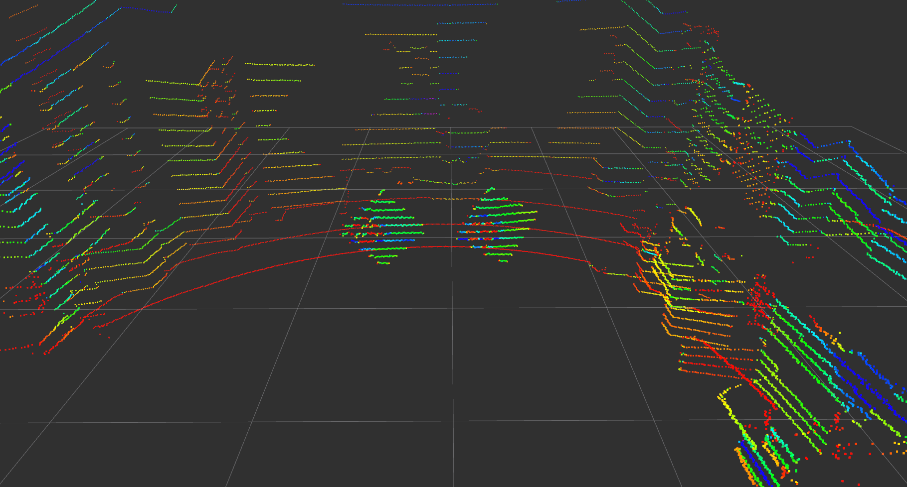
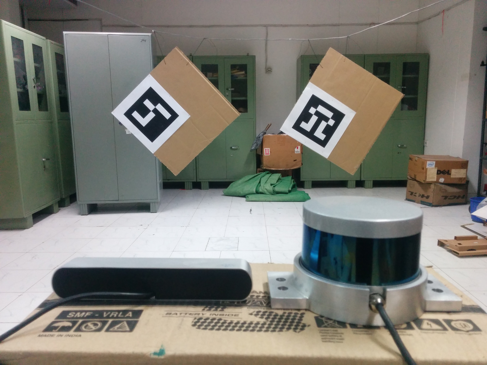
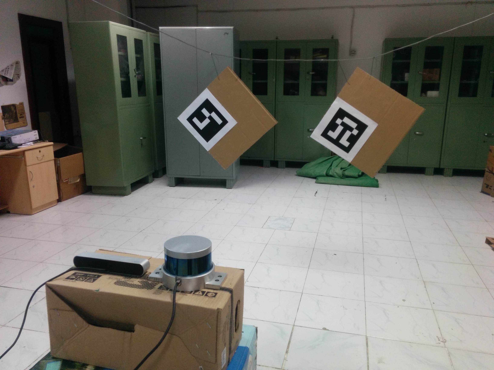
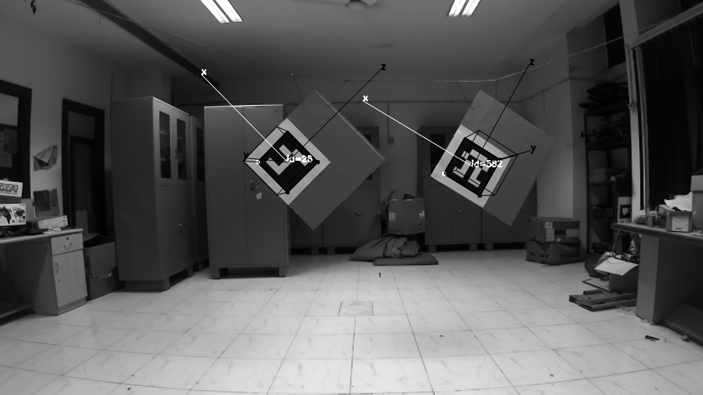
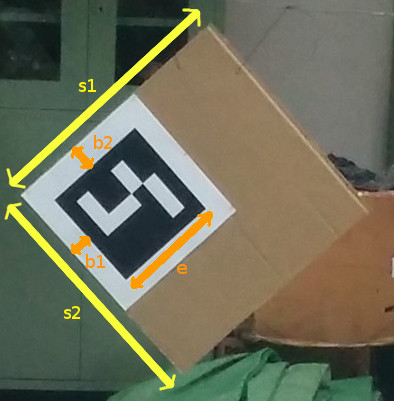
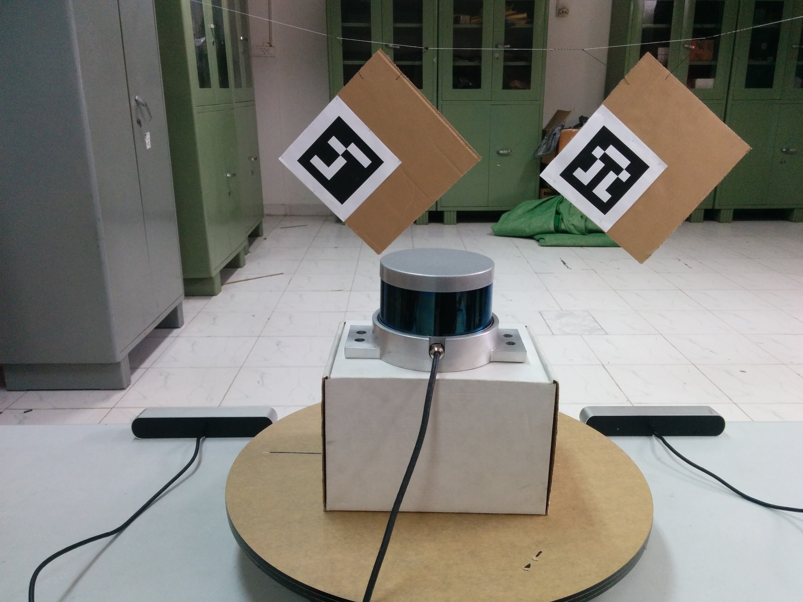
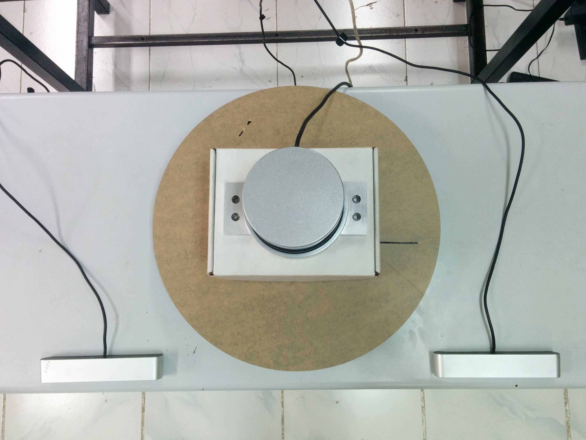
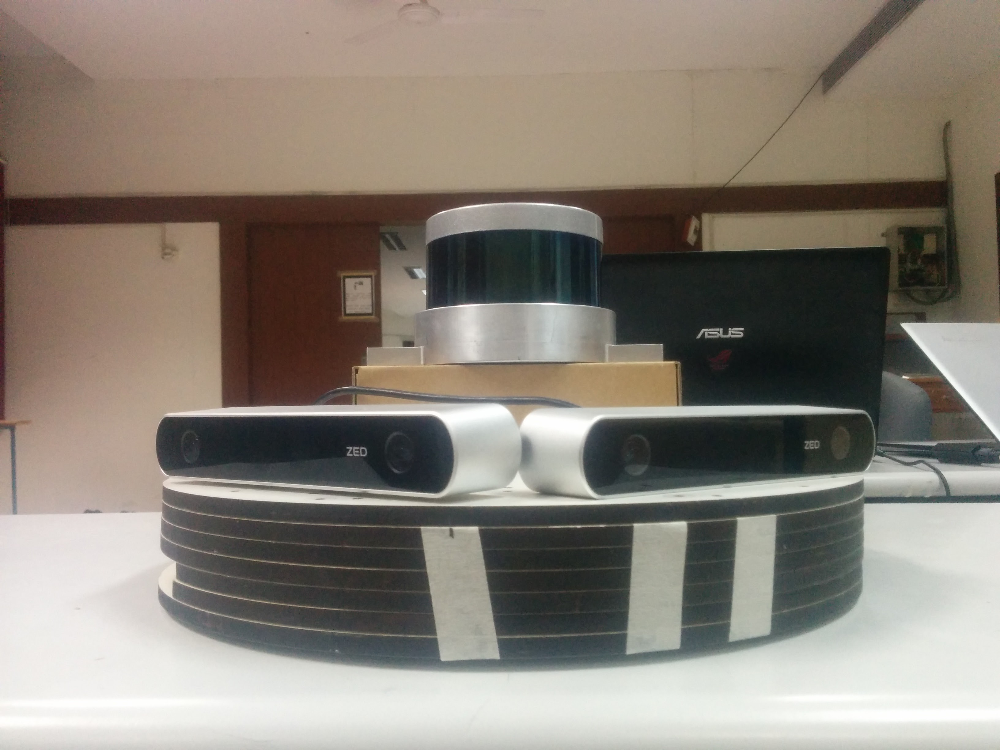
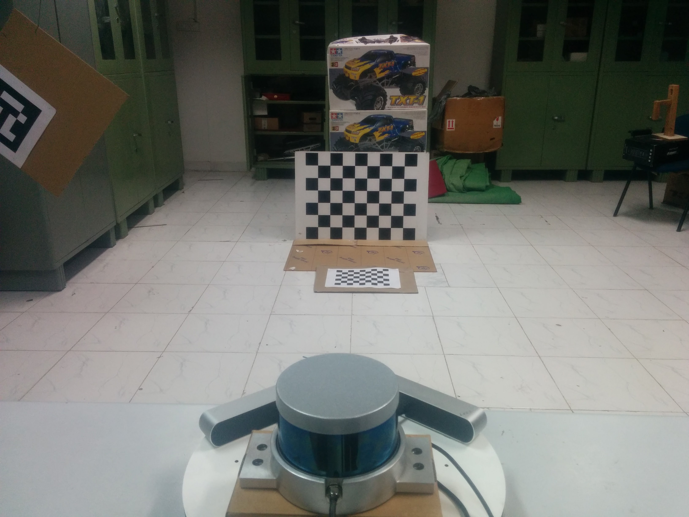
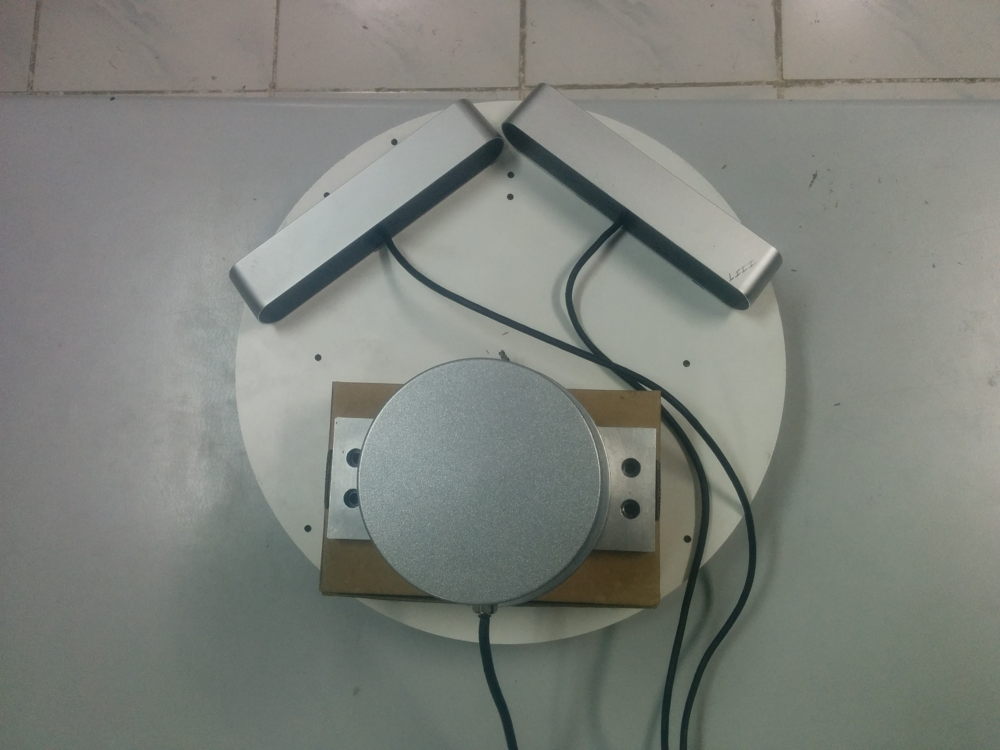

# LiDAR-Camera Calibration using 3D-3D Point correspondences
[Ankit Dhall](https://ankitdhall.github.io/ "Ankit Dhall"), [Kunal Chelani](http://www.chalmers.se/en/Staff/Pages/chelani.aspx "Kunal Chelani"), Vishnu Radhakrishnan, KM Krishna

<p align="left">
  <!-- <a href="https://github.com/ankitdhall/lidar_camera_calibration"></a> -->
  <a href="https://github.com/ankitdhall/lidar_camera_calibration"></a>
  <a href="https://github.com/ankitdhall/lidar_camera_calibration"></a>
  <a href="https://github.com/ankitdhall/lidar_camera_calibration"></a>
</p>

---

## ROS package to calibrate a camera and a LiDAR.



The package is used to calibrate a LiDAR (config to support Hesai and Velodyne hardware) with a camera (works for both monocular and stereo).

The package finds a rotation and translation that transform all the points in the LiDAR frame to the (monocular) camera frame. Please see [Usage](#usage) for a video tutorial. The `lidar_camera_calibration/pointcloud_fusion` provides a script to fuse point clouds obtained from two stereo cameras. Both of which were extrinsically calibrated using a LiDAR and `lidar_camera_calibration`. We show the accuracy of the proposed pipeline by fusing point clouds, with near perfection, from multiple cameras kept in various positions. See [Fusion using `lidar_camera_calibration`](#fusion-using-lidar_camera_calibration) for results of the point cloud fusion (videos).  

For more details please refer to our [paper](http://arxiv.org/abs/1705.09785).

### Citing `lidar_camera_calibration`
Please cite our work if `lidar_camera_calibration` and our approach helps your research.  

```
@article{2017arXiv170509785D,
   author = {{Dhall}, A. and {Chelani}, K. and {Radhakrishnan}, V. and {Krishna}, K.~M.
    },
    title = "{LiDAR-Camera Calibration using 3D-3D Point correspondences}",
  journal = {ArXiv e-prints},
archivePrefix = "arXiv",
   eprint = {1705.09785},
 primaryClass = "cs.RO",
 keywords = {Computer Science - Robotics, Computer Science - Computer Vision and Pattern Recognition},
     year = 2017,
    month = may
}
```
  

## Contents
1. [Setup and Installation](#setup-and-installation)
2. [Future Improvements](#future-improvements)
3. [Getting Started](#getting-started)
4. [Usage](#usage)
5. [Results and point cloud fusion using `lidar_camera_calibration`](#fusion-using-lidar_camera_calibration)

## Setup and Installation

Please follow the installation instructions for your Ubuntu Distrubtion **[here](https://github.com/ankitdhall/lidar_camera_calibration/wiki/Welcome-to-%60lidar_camera_calibration%60-Wiki!)** on the Wiki

## Future improvements

As an open-source project, your contributions matter! If you would like to contribute and improve this project consider submitting a pull request.

- [x] iterative process with ~~weighted~~ average over multiple runs
- [x] passing Workflows for Kinetic, Melodic and Noetic
- [x] Hesai and Velodyne LiDAR options (see [Getting Started](#getting-started))
- [ ] integrate LiDAR hardware from other manufacturers
- [ ] automate process of marking line-segments
- [ ] Github Workflow with functional test on dummy data
- [ ] support for upcoming Linux Distros


## Getting Started

 

There are a couple of configuration files that need to be specfied in order to calibrate the camera and the LiDAR. The config files are available in the `lidar_camera_calibration/conf` directory. The `find_transform.launch` file is available in the `lidar_camera_calibration/launch` directory.

### config_file.txt

>1280 720  
>-2.5 2.5  
>-4.0 4.0  
>0.0 2.5  
>0.05  
>2  
>0  
>611.651245 0.0        642.388357 0.0  
>0.0        688.443726 365.971718 0.0  
>0.0        0.0        1.0        0.0  
>1.57 -1.57 0.0  
>0

The file contains specifications about the following:

>image_width image_height  
>x- x+  
>y- y+  
>z- z+  
>cloud_intensity_threshold  
>number_of_markers  
>use_camera_info_topic?  
>fx     0       cx      0  
>0      fy      cy      0  
>0      0       1       0

>MAX_ITERS

>initial_rot_x initial_rot_y initial_rot_z

>lidar_type

`x-` and `x+`, `y-` and `y+`, `z-` and `z+` are used to remove unwanted points in the cloud and are specfied in meters. The filtred point cloud makes it easier to mark the board edges. The filtered pointcloud contains all points   
(x, y, z) such that,  
x in [`x-`, `x+`]  
y in [`y-`, `y+`]  
z in [`z-`, `z+`]  

The `cloud_intensity_threshold` is used to filter points that have intensity lower than a specified value. The default value at which it works well is `0.05`. However, while marking, if there seem to be missing/less points on the cardboard edges, tweaking this value will might help.

The `use_camera_info_topic?` is a boolean flag and takes values `1` or `0`(**Though you can set it to 1 with using the camera_info topic, but we still recommend you strongly to set it to 0 and then using the calibration file, unless you make sure the camera info topic's value is consistent with calibration file or there is only a pretty small difference between them, otherwise, you won't the result you want**). The `find_transform.launch` node uses camera parameters to process the points and display them for marking. If you wish to use the `camera_info` topic to read off the parameters, set this to `1`. Else, the explicitly provided camera parameters in `config_file.txt` are used.

`MAX_ITERS` is the number of iterations, you wish to run. The current pipeline assumes that the experimental setup: the boards are almost stationary and the camera and the LiDAR are fixed. The node will ask the user to mark the line-segments (see the video tutorial on how to go about marking [Usage](#usage)) for the first iteration. Once, the line-segments for each board have been marked, the algorithm runs for `MAX_ITERS`, collecting live data and producing n=`MAX_ITERS` sets of rotation and translation in the form of 4x4 matrix. Since, the marking is only done initially, the quadrilaterals should be drawn large enough such that if in the iterations that follow the boards move slightly (say, due to a gentle breeze) the edge points still fall in their respective quadrilaterals. After running for `MAX_ITERS` number of times, the node outputs an average translation vector (3x1) and an average rotation matrix (3x3). Averaging the translation vector is trivial; the rotations matrices are converted to quaternions and averaged, then converted back to a 3x3 rotation matrix.

`initial_rot_x initial_rot_y initial_rot_z` is used to specify the initial orientation of the lidar with respect to the camera, in radians. The default values are for the case when both the lidar and the camera are both pointing forward. The final transformation that is estimated by the package accounts for this initial rotation.

`lidar_type` is used to specify the lidar type. `0` for Velodyne; `1` for Hesai-Pandar40P.
Hesai driver by default **does not** publish wall time as time stamps. To solve this, modify `lidarCallback` function in `/path/to/catkin_ws/src/HesaiLidar-ros/src/main.cc` as follows: 
```
void lidarCallback(boost::shared_ptr<PPointCloud> cld, double timestamp)
{
    pcl_conversions::toPCL(ros::Time(timestamp), cld->header.stamp);
    sensor_msgs::PointCloud2 output;
    pcl::toROSMsg(*cld, output);
    output.header.stamp = ros::Time::now(); // ADD
    lidarPublisher.publish(output);
}
```

### marker_coordinates.txt

The ArUco markers are stuck on the board such that when it is hung from a corner, the ArUco marker is on the left side of the board.

After everything is setup, it should look something like this. Notice how the axis are aligned. `y-axis` should point outwards, `x-axis` along the `breadth (s2)` and `z-axis` along the `length (s1)`. The markers are also arranged so that the `ArUco id` are in ascending order.


>2  
>48.4  
>46.8  
>4.0  
>5.0  
>20.5  
>49.0  
>46.8  
>4.0  
>5.0  
>20.5  

After sticking the ArUco marker on a planar cardboard, it will look like this.  


The first line specfies 'N' the number of boards being used. Followed by N*5 lines with the following information about the dimensions of the board:
>length (s1)  
>breadth (s2)  
>border_width_along_length (b1)  
>border_width_along_breadth (b2)  
>edge_length_of_ArUco_marker (e)  

All dimensions in `marker_coordinates.txt` are in centimeters.


### lidar_camera_calibration.yaml

>lidar_camera_calibration:  
>  camera_frame_topic: /frontNear/left/image_raw  
>  camera_info_topic: /frontNear/left/camera_info  
>  velodyne_topic: /velodyne_points

Contains name of camera and velodyne topics that the node will subscribe to.

### find_transform.launch

Parameters are required for the `aruco_mapping` node and need to be specfied here. Ensure that the topics are mapped correctly for the node to function.
Other parameters required are:  
* calibration_file(.ini format)    
* num_of_markers  
* marker_size(in meters)  

For more information about the `aruco_mapping` package refer to their [documentation](https://github.com/SmartRoboticSystems/aruco_mapping).

## Usage

A more detailed video tutorial on how to go about using the node can be found at [https://youtu.be/SiPGPwNKE-Q](https://youtu.be/SiPGPwNKE-Q).

Before launching the calibration node ensure that the ArUco markers are visible in the camera frame and the markers are arragned in ascending order of their `ArUco ids` (`ArUco ids` and their co-ordinate frame can be found/viewed by running the original `aruco_mapping` [package](https://github.com/SmartRoboticSystems/aruco_mapping)) from left to right as viewed by the camera.

Use the following command to start the calibration process once everything is setup.

```shell
roslaunch lidar_camera_calibration find_transform.launch
```

An initial [R|t] between the camera and the various ArUco markers will be estimated. Following this, a filtered point cloud (according to the specifications in the `config_file.txt`) will be displayed. The user needs to mark each edge of the rectangular board.

Each board will have 4 line segments and need to be marked from leftmost board to the rightmost board. Marking a line segment is quite straight-forward, one needs to draw a quadrilateral around the line being marked. Click and press a key to confirm the corner of the quadrilateral. Once 4 points are clicked, each followed by a key-press, the program will move on to the next line segment. Continue marking the line segments for all boards until complete.
Line segments for each board are to be marked in clock-wise order starting from the top-left.

After marking all the line-segments, the rigid-body transformation between the camera and the LiDAR frame will be displayed.

Intermediate values are logged in `conf/points.txt`.

### points.txt
This contains `num_of_sensors*(num_of_markers*points_per_board)` 3D points, here, `num_of_sensors` is fixed to 2 and the `points_per_board`=4, the four corner points.  
So if `num_of_markers` = 2, then,  
* the first 4 points represent the first board,  
* next 4 points represent the second board,  
both of which are 3D co-ordinates in meters, viewed from the `lidar` origin.  
* the next 4 points represent the first board,  
* the next 4 points represent the second board,  
both of which are 3D co-ordinates in meters, viewed from the `camera` origin.  
The points are ordered according to their correspondences, i.e. the second point in the first 8 points has a correspondence with the second point in the last 8 points in this case.

## Fusion using `lidar_camera_calibration`
To verify the method in a more intuitive manner, `lidar_camera_calibration` was used to fuse point clouds obtained from two stereo cameras.  

### Manual measurement vs. `lidar_camera_calibration`

First, we compare the calibration parameters obtained from `lidar_camera_calibration` against meticulously measured values using tape by a human. The setup looked something like the this:

 

The fused point cloud obtained when using manual measurements versus when using `lidar_camera_calibration` is shown in the video. Notice the large translation error, even when the two cameras are kept on a planar surface. Hallucinations of markers, cupboards and carton box (in the background) can be seen as a result of the two point clouds not being aligned properly.  

On the other hand, rotation and translation estimated by `lidar_camera_calibration` almost perfectly fuses the two individual point clouds. There is a very minute translation error (~1-2cm) and almost no rotation error. The fused point cloud is aligned so properly, that one might actually believe that it is a single point cloud, but it actually consists of 2 clouds fused using extrinsic transformation between their sources (the stereo cameras).

The resultant fused point clouds from both manual and `lidar_camera_calibration` methods can be seen in [this video](https://youtu.be/AbjRDtHLdz0).


### Calibrating cameras kept at ~80 degrees
We also wanted to see the potential of this method and used it to calibrate cameras kept at ~80 degrees and almost no overlapping field-of-view. In principle, with a properly designed experimental setup our method can calibrate cameras with zero overlapping field of view.  

However, to visualize the fusion, we needed a part to be common in both point clouds. We chose a large checkerboard to be seen in both FOVs, since it can be used to see how well the point clouds have aligned and if the dimensions of the checkerboard squares are known, one can even estimate the translation errors.

The setup for such an experiment looked something like this:  
    

There is very less translation error, about 3-4 cm. Also, the ground planes align properly, at all distances, near and far from the camera, implying that the rotations estimated are correct.  

The resultant fused point clouds after extrinsic calibration of stereo cameras kept at ~80 degrees using `lidar_camera_calibration` can be seen in [this video](https://youtu.be/Om1SFPAZ5Lc).  

We believe, that better intrinsic calibration of the cameras can help drive down the error to about 1 centimeter or even less.
